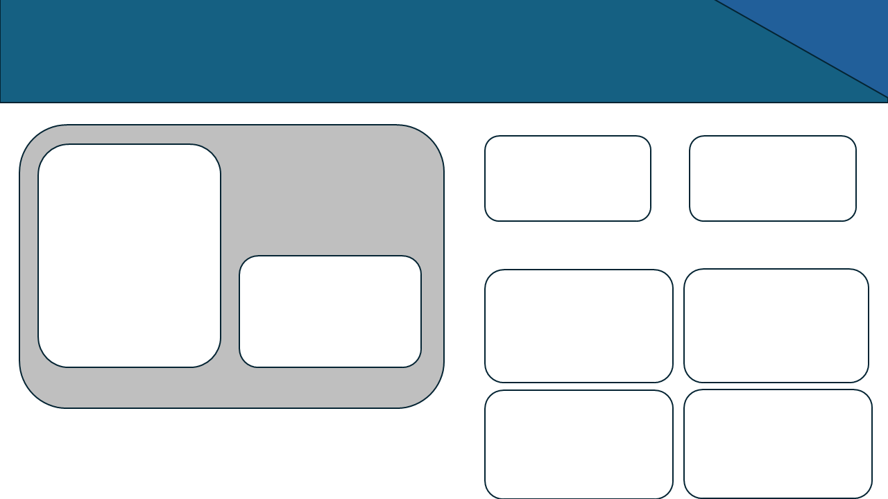

# LittleLemonDB_Dashboard
Interactive dashboard built by Power BI for old project related with "Meta Database Engineer Specialization" ,
Repository for Capstone Project of "Meta Database Engineer" [From here](https://github.com/Saad711T/Little_Lemon_DB).

## Requirements

<a href="https://www.microsoft.com/en-us/power-platform/products/power-bi" target="_blank"> </a

---

#### Design Preview

## Credits
[0xSaad](https://x.com/0xdonzdev)
